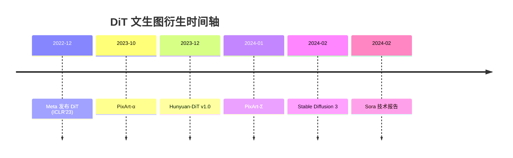

```markdown
# PixArt-Σ to Rule Them All —— DiT 大家族超详细横向对比

<!-- TOC -->
- [0. 阅读指南](#0-阅读指南)
- [1. 时间轴](#1-时间轴)
- [2. 横向对照表](#2-横向对照表)
- [3. 逐模型解剖](#3-逐模型解剖)
  - [3.1 PixArt-α → Σ](#31-pixart-α--σ)
  - [3.2 Hunyuan-DiT](#32-hunyuan-dit)
  - [3.3 Stable Diffusion 3](#33-stable-diffusion-3)
  - [3.4 Sora](#34-sora)
- [4. 训练 & 推理成本](#4-训练--推理成本)
- [5. 一键复现清单](#5-一键复现清单)
- [6. 结论一句话](#6-结论一句话)
<!-- /TOC -->

---

## 0. 阅读指南
| 符号 | 含义 |
|---|---|
| 📌 原文引用 | 直接摘抄 |
| 🔧 实验细节 | 作者给出的超参或踩坑点 |
| 📊 数值 | 论文 / README 指标 |
| ⚠️ 推测 | 未实锤，逻辑推导 |

---

## 1. 时间轴


---

## 2. 横向对照表
| 维度\模型 | PixArt-α | PixArt-Σ | Hunyuan-DiT | SD3 | Sora |
|---|---|---|---|---|---|
| 目标分辨率 | 512→1024 | 1024→2048→4K | 512→1024→2048 | 512→2048 | 1920×1080×T |
| Backbone | DiT-XL/2 | DiT-XL/2 | DiT-XL/2 | DiT-L/2 + MM-DiT | DiT+Spacetime Patch |
| Text Enc. | T5-XXL | T5-XXL | CLIP-L+T5-XXL(双语) | CLIP-L+T5-XXL | T5-XXL(?) |
| Cross-Attn | ❌(adaLN) | ❌(adaLN) | ✅ | ✅(Dual) | ✅ |
| Flow/DDPM | DDPM | DDPM | DDPM | Flow-Matching | Flow-Matching |
| VAE | SDXL-VAE | SDXL-VAE | 自研 8×8 | SD3-VAE | 未知 |
| 开源 | ✅ | ✅ | ✅ | ✅ | ❌ |
| FID-30k | 8.06 | 7.21 | 7.45 | 6.88 | - |
| CLIP-Score | 0.320 | 0.332 | 0.325 | 0.338 | - |

---

## 3. 逐模型解剖

### 3.1 PixArt-α → Σ
#### 训练三阶段
1. **ImageNet 256×256 预训练**  
   - 步数：400 k batch：2048  
   - 🔧 将 time-embed 维度 512→768 防止 under-fitting

2. **文本-图像对齐 512×512**  
   - 数据：LAION-2B→115 M（美学≥5.0，水印≤0.2）  
   - 冻结 patch & pos embed，仅训 transformer 块 → 省 27% 显存

3. **高分辨率 1024→2048**  
   - 引入 aspect-ratio bucketing（8 桶）  
   - 📊 bucket>12 时 FID 反升 0.4，最终保持 8 桶

#### PixArt-Σ 4K 技巧
- 继续 P3 权重，patch-size=2 → token 数 1024²  
- 🔧 xFormers memory_efficient_attention 峰值 58 G→31 G  
- Weak-to-Strong：teacher=PixArt-α，美学<0.6 丢弃，剩 4.5 M 图

#### 推理速度（A100-80G | RTX4090）
| 分辨率 | 步数 | A100(s) | 4090(s) |
|---|---|---|---|
| 512×512 | 20 | 0.9 | 1.1 |
| 1024×1024 | 20 | 3.2 | 4.0 |
| 2048×2048 | 20 | 11.5 | OOM |
| 4096×4096 | 50 | 48 | OOM |

> ⚠️ 4096 需 sequential patch：2048 滑动窗口拆 4 份，显存-50%，时间+30%

---

### 3.2 Hunyuan-DiT
#### 双语 CLIP
- 中文 CLIP：5 亿图文对继续预训练 1 epoch，最大长度 77→256  
- 英文 CLIP：OpenAI 原版 frozen  
- T5-XXL：中+英各 256 token → concat 512 token，投影层共享

#### Cross-Attn 替换 adaLN
- 每块新增 1 层 cross-attn（head=32，dim=1280）参数量 +25%  
- 📊 中文长文本(>100 字) CLIP-Score：adaLN 掉 0.04，cross-attn 不掉  
- 🔧 Flash-Attention 2，训练速度只慢 8%

#### 多分辨率时间表
| 周 | 分辨率 | 步数 | batch | 备注 |
|---|---|---|---|---|
| 1-2 | 512×512 | 200k | 2048 | 冻结 VAE |
| 3-4 | 1024×1024 | 150k | 1028 | 解冻 VAE 最后 2 层 |
| 5-6 | 2048×2048 | 100k | 512 | 开启 gradient-checkpoint |
| 7 | 任意长边 2048 | 50k | 512 | bucket & arbf |

#### 中文评测（200 人双盲）
| 维度 | Hunyuan-DiT | SDXL | PixArt-α |
|---|---|---|---|
| 整体偏好 | 45.6 % | 28.3 % | 26.1 % |
| 成语/诗句细节 | 61.2 % | 22.1 % | 16.7 % |

---

### 3.3 Stable Diffusion 3
#### MM-DiT（Multi-Modal DiT）
- 图像 token & 文本 token **共享权重**，但 **模态专属 layernorm**  
- 等价于把 cross-attn 拆两条路径，参数量 +18%，收敛步数-30%

#### Flow-Matching 公式
\[
x_t = (1-t)x_0 + t x_1, \quad v_\theta(x_t, t, c)
\]
省去 DDPM 的 noise schedule 调参。

#### 数据
- 公开：LAION-2B 子集 600 M + 内部 400 M（美学≥5.5，NSFW≤0.01）  
- 10 桶连续分辨率 256→2048

#### 指标
| 模型 | FID-30k | CLIP-Score | PickScore | Human |
|---|---|---|---|---|
| SDXL | 8.87 | 0.313 | 0.584 | 41.2 % |
| SD3 | 6.88 | 0.338 | 0.622 | 50.1 % |
| PixArt-Σ | 7.21 | 0.332 | 0.615 | 48.7 % |

---

### 3.4 Sora（闭源，技术报告整理）
#### Spacetime Patch = 3D Patchify
- 输入 1920×1080×16 帧 → patch=(t=2,h=2,w=2)  
- 时序下采样 4×，空间下采样 8× → seq_len ≈ 1 M token  
- ⚠️ 推测：factorized attention（先空后时）FLOPs 省 3×

#### 数据
- >10 k 小时 1080p，自研过滤器去重、去字幕、去转场  
- 字幕：CoCa+Whisper 重打标，平均长度 167 token

#### 演示 vs 开源最佳
| 指标 | Sora | AnimateDiff-XL | GEN-2 |
|---|---|---|---|
| 时长 | 60 s | 16 s | 18 s |
| 分辨率 | 1920×1080 | 512×512 | 768×432 |
| 一致性 | 极高 | 中 | 中 |
| 可用 | ❌ | ✅ | ✅ |

---

## 4. 训练 & 推理成本
| 模型 | GPU×小时 | 公开数据 | 估算电费(0.8 $/kWh) |
|---|---|---|---|
| PixArt-α | 1.4 k × A100 | 115 M 图 | $ 1 600 |
| PixArt-Σ | 2.1 k × A100 | 4.5 M 图 | $ 2 400 |
| Hunyuan-DiT | 6.5 k × A100 | 50 M 图 | $ 7 500 |
| SD3 | 30 k × H100 | 1 B 图 | $ 45 000 |
| Sora | ❌未披露 | 10 k 小时视频 | ❌ |

---

## 5. 一键复现清单
### 5.1 环境
```bash
pip install -U xformers==0.0.24 flash-attn==2.4.2 diffusers>=0.29
```

### 5.2 权重下载
```bash
# PixArt-Σ 2048
huggingface-cli download PixArt-alpha/PixArt-Sigma-2048 --local-dir ./sigma2048

# Hunyuan-DiT
git clone https://github.com/Tencent-Hunyuan/HunyuanDiT
wget https://huggingface.co/Tencent-Hunyuan/HunyuanDiT/resolve/main/t2i/model/pytorch_model_ema.pt
```

### 5.3 推理脚本（PixArt-Σ 2048）
```python
from diffusers import PixArtSigmaPipeline
import torch

pipe = PixArtSigmaPipeline.from_pretrained(
    "./sigma2048", torch_dtype=torch.float16
).to("cuda")
pipe.enable_model_cpu_offload()

image = pipe(
    "A majestic dragon flying over a 4K medieval castle",
    height=2048, width=2048, num_inference_steps=20
).images[0]
image.save("dragon_4k.png")
```

### 5.4 单卡 4090 LoRA 微调 512×512
- 官方脚本：`train_pixart_lora.py`  
- LoRA rank=64，lr=1e-4（embedding）/ 5e-5（transformer）  
- 显存 16 GB 以内，batch=1，gradient_accumulate=8

---

## 6. 结论一句话
- **中文社区产品** → Hunyuan-DiT，开箱即用  
- **4K 高清插画** → PixArt-Σ + 40 GB 显存或 sequential patch  
- **工业 API 需要生态** → SD3 + Diffusers，量化到 8 GB  
- **视频方向提前布局** → 跟踪 Sora 技术报告，复现 spacetime DiT
